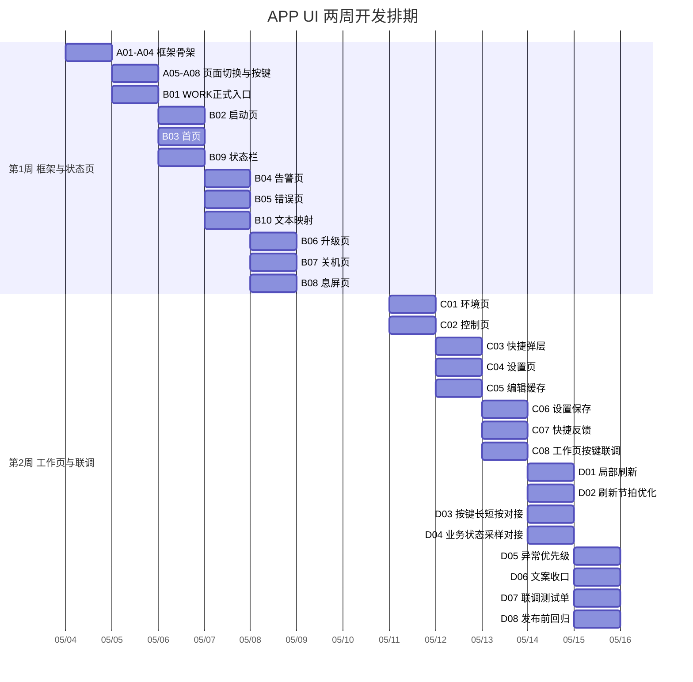

# APP UI 周计划 / 甘特式排期表

## 1. 文档说明
本表用于把《APP UI 开发任务拆解表》转成可以直接执行、直接打勾、直接同步进度的排期文档。

建议使用方式：
- 每日开发前，先确认当天任务是否具备依赖条件。
- 每项完成后直接勾选复选框。
- 每周例会按“已完成 / 进行中 / 阻塞”更新。
- 若计划变动，优先修改周计划，再同步开发任务拆解表状态。

## 2. 计划基线
- 计划起始日：`2026-05-04`（建议以下周一作为启动日）
- 计划周期：`2 周 / 10 个工作日`
- 执行模式：`1 人主开发` 基线排期
- 关键目标：先替换 `WORK` 测试页，再补齐正式页面与交互

## 3. 周计划（可打勾）

### 第 1 周：框架搭建 + 核心状态页闭环

#### 周目标
- 打通 UI 页面模型、统一绘制入口、按键入口。
- 完成 `BOOTING / HOME / ALARM / ERROR / UPGRADE / CLOSING / SLEEP` 主链路。
- 让 `WORK` 态彻底脱离 `vDisp_UiTest()` 测试页。

#### Day 1（2026-05-04，周一）
- [ ] A01 建立页面枚举
- [ ] A02 建立页面上下文
- [ ] A03 建立统一绘制入口
- [ ] A04 建立三段布局模板
- [ ] 输出：页面模型头文件、统一绘制入口原型、基础布局函数

#### Day 2（2026-05-05，周二）
- [ ] A05 建立软键文案模型
- [ ] A06 建立按键分发入口
- [ ] A07 建立页面切换规则
- [ ] A08 建立脏区刷新模型
- [ ] B01 接管 `WORK` 正式入口
- [ ] 输出：工作态正式调度骨架，可进入正式页面分发逻辑

#### Day 3（2026-05-06，周三）
- [ ] B02 实现 `P01_BOOTING` 页面
- [ ] B03 实现 `P10_HOME` 页面
- [ ] B09 实现状态栏摘要
- [ ] 输出：启动页、首页、统一状态栏可显示

#### Day 4（2026-05-07，周四）
- [ ] B04 实现 `P13_ALARM` 页面
- [ ] B05 实现 `P23_ERROR` 页面
- [ ] B10 建立错误/告警文本映射
- [ ] 输出：普通告警页与严重错误页闭环完成

#### Day 5（2026-05-08，周五）
- [ ] B06 实现 `P20_UPGRADE` 页面
- [ ] B07 实现 `P21_CLOSING` 页面
- [ ] B08 实现 `P22_SLEEP` 页面
- [ ] 周内回归：`INIT -> BOOTING -> HOME -> ALARM/ERROR -> CLOSING -> SLEEP`
- [ ] 输出：第一版可演示 UI

#### 第 1 周检查点
- [ ] `WORK` 态已切到正式页面调度
- [ ] 核心状态页均可显示
- [ ] 严重错误可覆盖普通工作页
- [ ] 长按 `Enter` 关机流程显示正确
- [ ] 息屏唤醒“首键只唤醒不透传”生效

### 第 2 周：工作页交互 + 优化联调 + 验收

#### 周目标
- 完成 `ENV / ACT / QUICK / SETTING` 工作页交互。
- 接通设置缓存、参数保存、快捷控制反馈。
- 完成局部刷新、联调与验收回归。

#### Day 6（2026-05-11，周一）
- [ ] C01 实现 `P11_ENV` 页面
- [ ] C02 实现 `P12_ACT` 页面
- [ ] 输出：环境页和控制页基础功能可用

#### Day 7（2026-05-12，周二）
- [ ] C03 实现 `P12A_QUICK` 弹层
- [ ] C04 实现 `P14_SETTING` 页面
- [ ] C05 建立编辑缓存模型
- [ ] 输出：快捷层、设置页、编辑缓存逻辑打通

#### Day 8（2026-05-13，周三）
- [ ] C06 实现设置保存逻辑
- [ ] C07 接入快捷控制反馈
- [ ] C08 实现工作页按键细则
- [ ] 输出：工作页完整交互闭环完成

#### Day 9（2026-05-14，周四）
- [ ] D01 完成局部刷新机制
- [ ] D02 优化刷新节拍
- [ ] D03 对接按键长短按事件
- [ ] D04 对接业务状态采样
- [ ] 输出：局刷与关键模块联调完成

#### Day 10（2026-05-15，周五）
- [ ] D05 对接异常优先级
- [ ] D06 补齐文案与缩写
- [ ] D07 完成联调测试单
- [ ] D08 完成发布前回归
- [ ] 输出：可验收版本与回归记录

#### 第 2 周检查点
- [ ] `HOME / ENV / ACT / ALARM / SETTING` 可循环切页
- [ ] 快捷弹层可进入、执行、退出
- [ ] 设置项支持“编辑缓存 + 确认保存”
- [ ] 数值页刷新闪烁可接受
- [ ] 升级、异常、息屏、唤醒、设置保存主路径回归通过

## 4. 甘特式排期表（Mermaid）

> 建议在 VS Code Markdown 预览中查看，便于直观看时间轴。

## 5. 里程碑打勾表
- [ ] M1 框架可用：A01~A08 完成
- [ ] M2 核心页面闭环：B01~B10 完成
- [ ] M3 工作页可操作：C01~C08 完成
- [ ] M4 发布候选：D01~D08 完成

## 6. 每日站会更新模板

### 今日完成
- [ ] 已完成任务编号：
- [ ] 已验证页面/路径：

### 当前进行中
- [ ] 进行中任务编号：
- [ ] 当前问题点：

### 明日计划
- [ ] 下一步任务编号：
- [ ] 需要联调模块：

### 阻塞项
- [ ] 无
- [ ] 有，说明如下：

## 7. 风险缓冲建议
- 若 `B01` 比预期晚完成，后续所有工作页任务顺延 1 天。
- 若参数保存接口或告警接口尚未稳定，先使用假数据打通页面框架，再回填真实接口。
- 若局刷风险偏高，可先保持整页刷新交付可用版本，再在 `D01` 独立优化。

## 8. 结论
这份排期表适合直接用于：
- 每日打勾推进
- 每周例会同步
- 作为 UI 落地的短周期执行计划

建议你下一步以 `Day 1 / Day 2` 为起点，正式进入 `A01~A08 + B01` 的代码实施阶段。